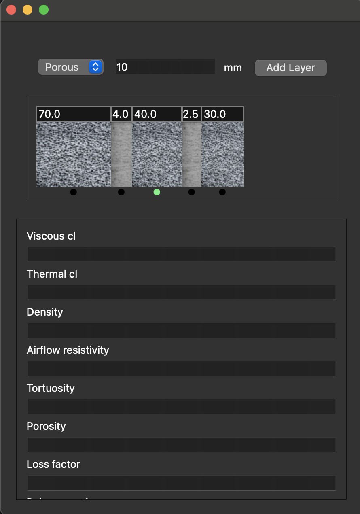

# MetamaterialCalculator
## Material properties database
## AI assistant for DB requests

In this folder I'll make my own implementation for material DB fill with PostdegreeSQL and AI assistant (via FastAPI, etc)

Current GUI:
1. Add layers with 2 possible types: solid, porous
2. Change the thickness of the layer using TextBox above the the layer schematic image
3. Press into any layer on schematic image to see or modify its paramteres
4. Selected layer marked by green dot below the layer

