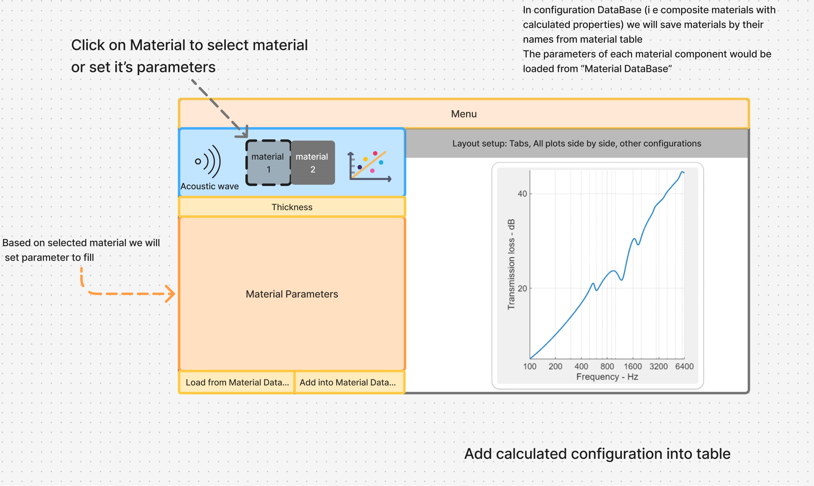

# MetamaterialCalculator
## Material properties database
## AI assistant for DB requests

In this folder I'll make my own implementation for material DB fill with PostdegreeSQL and AI assistant (via FastAPI, etc)

Builded in Figma GUI (0)
